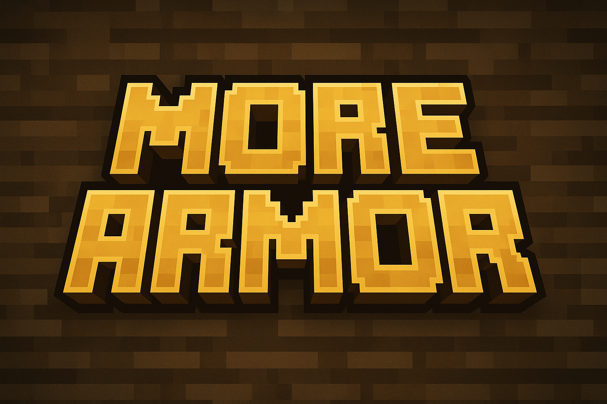
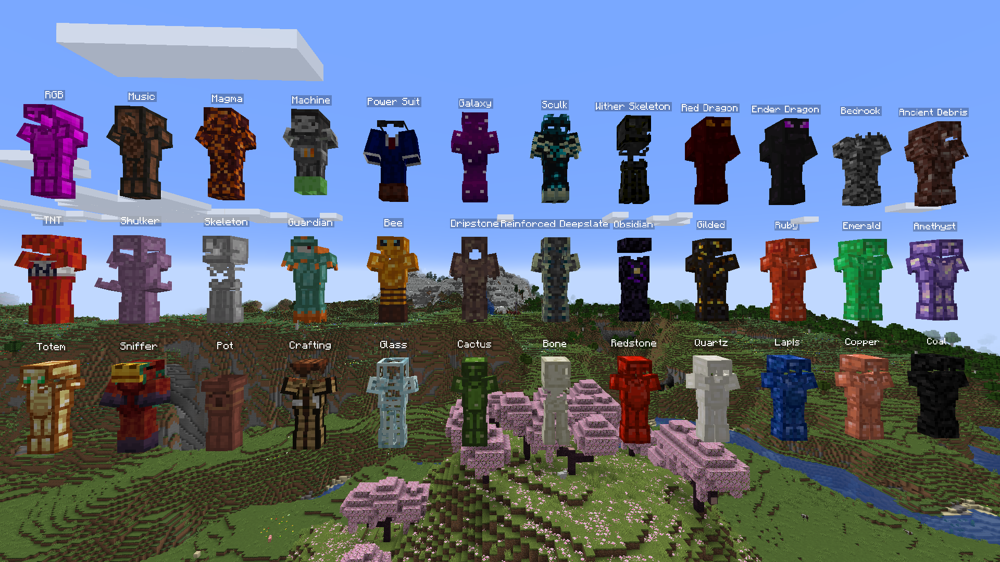

# More Armor Mod

**A comprehensive Minecraft mod that adds some fun to your world with 36 unique armor sets featuring beautiful animations and unique designs.**

[**Features**](#features) • [**Armor Showcase**](docs/ARMOR_SHOWCASE.md) • [**Gallery**](#gallery) • [**License**](#license)

---

## Features

### **36 Armor Sets**
• Bee Armor • Ender Dragon Armor • Galaxy Armor • Guardian Armor • Machine Armor • Magma Armor • Music Armor • Obsidian Armor • Pot Armor • Red Dragon Armor • RGB Armor • Sculk Armor • Sniffer Armor • TNT Armor • Ancient Debris Armor • Amethyst Armor • Bedrock Armor • Bone Armor • Cactus Armor • Coal Armor • Copper Armor • Crafting Armor • Dripstone Armor • Emerald Armor • Gilded Armor • Glass Armor • Lapis Armor • Power Suit Armor • Quartz Armor • Redstone Armor • Reinforced Deepslate Armor • Ruby Armor • Shulker Armor • Skeleton Armor • Totem Armor • Wither Skeleton Armor

---

## Configuration

Fully configurable armor stats (durability, protection, enchantability, toughness, knockback resistance) via `config/morearmor-common.toml` config file. 

**Note:** Changes require a game or server restart to take effect.

## Gallery

### **In-Game Showcase**

**[📖 View Full Armor Showcase](docs/ARMOR_SHOWCASE.md)** - See closeups of each armor set

## Asset Credits

### **Textures & Models**
- **AverageTaTeMan** - Original armor designs
- **License**: [MIT License](src/main/resources/assets/morearmor/textures/averagetateman/LICENSE)
- **Original Resource Pack**: [TaTe's Custom Armors](https://modrinth.com/resourcepack/tates-custom-armors-and-elytras)

---

## License

This project is licensed under the **MIT License** - see the [LICENSE](LICENSE) file for details.