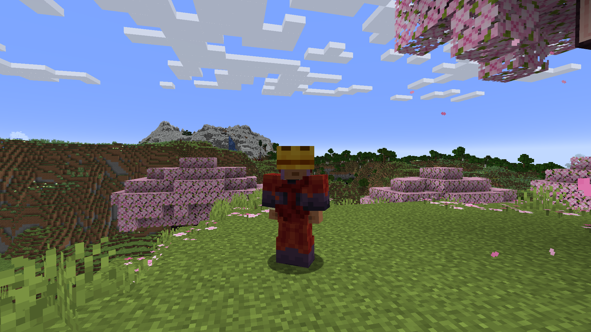

# MoreArmor - Armor Showcase

A visual showcase of all 36 unique armor sets in the MoreArmor mod. Each armor set features unique designs and balanced stats for different playstyles.

## Animated Armor Sets

### Bee Armor

*Honeycomb-themed armor with bee animations and natural aesthetics*

### Ender Dragon Armor

*Dragon-scale armor with mystical effects and end-game protection*

### Galaxy Armor

*Space-themed armor with cosmic animations and stellar design*

### Guardian Armor

*Ocean guardian-inspired armor with aquatic aesthetics*

### Machine Armor

*Industrial armor with mechanical animations and tech aesthetics*

### Magma Armor

*Fire-themed armor with lava effects and volcanic design*

### Music Armor

*Musical note-themed armor with sound animations*

### Obsidian Armor

*Dark volcanic armor with stone effects and durability*

### Pot Armor

*Flower pot-themed armor with plant animations*

### Red Dragon Armor

*Fiery dragon armor with flame effects and dragon aesthetics*

### RGB Armor

*Color-changing armor with rainbow animations*

### Sculk Armor

*Deep dark-themed armor with sculk effects*

### Sniffer Armor

*Ancient creature-inspired armor with prehistoric aesthetics*

### TNT Armor

*Explosive-themed armor with blast animations*

## Static Armor Sets

### Ancient Debris Armor

*Netherite-tier armor with high durability and nether aesthetics*

### Amethyst Armor

*Crystal-themed armor with magical properties and purple aesthetics*

### Bedrock Armor

*Unbreakable-themed armor with maximum protection*

### Bone Armor

*Skeletal-themed armor with natural toughness*

### Cactus Armor

*Desert-themed armor with spiky design*

### Coal Armor

*Dark-themed armor with mining aesthetics*

### Copper Armor

*Metallic armor with oxidation effects*

### Crafting Armor

*Workbench-themed armor for crafters*

### Dripstone Armor

*Cave-themed armor with stalactite design*

### Emerald Armor

*Precious gem armor with luxury aesthetics*

### Gilded Armor

*Gold-plated armor with royal appearance*

### Glass Armor

*Transparent armor with fragile beauty*

### Lapis Armor

*Blue gem armor with enchanting properties*

### Power Suit Armor

*High-tech armor with advanced protection*

### Quartz Armor

*Pure white armor with crystalline design*

### Redstone Armor

*Redstone-themed armor with technical aesthetics*

### Reinforced Deepslate Armor

*Underground-themed armor with stone reinforcement*

### Ruby Armor

*Red gem armor with fiery properties*

### Shulker Armor

*End-themed armor with shulker aesthetics*

### Skeleton Armor

*Undead-themed armor with bone reinforcement*

### Totem Armor

*Tribal-themed armor with protective properties*

### Wither Skeleton Armor

*Dark undead armor with wither effects*

---

## Armor Statistics

Each armor set comes with carefully balanced default stats that can be customized through the config file. For detailed statistics and customization options, see the main [README.md](../README.md#configuration) file.

### Default Examples:
- **Bedrock Armor**: 1100-1600 durability, 2-6 protection, 0.0 toughness
- **Ancient Debris Armor**: 448-651 durability, 3-8 protection, 3.0 toughness  
- **Ender Dragon Armor**: 580-850 durability, 4-8 protection, 3.0 toughness

All armor sets are fully configurable through `config/morearmor-common.toml` in your Minecraft folder.
