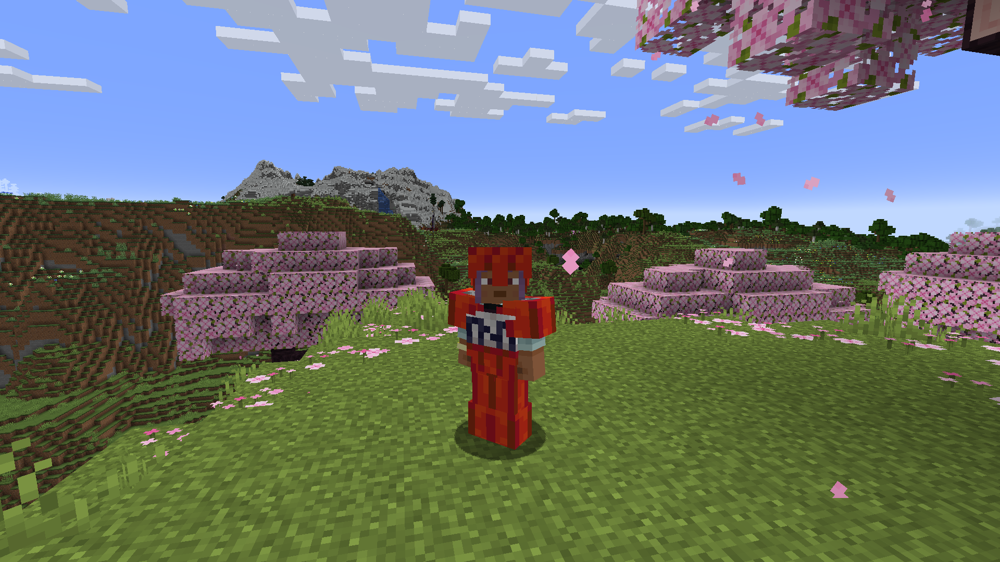

# MoreArmor - Armor Showcase

A visual showcase of all 36 unique armor sets in the MoreArmor mod. Each armor set features unique designs and balanced stats for different playstyles.

## Animated Armor Sets

### Bee Armor

### Ender Dragon Armor

### Galaxy Armor

### Guardian Armor

### Machine Armor

### Magma Armor

### Music Armor

### Obsidian Armor

### Pot Armor

### Red Dragon Armor

### RGB Armor

### Sculk Armor

### Sniffer Armor

### TNT Armor

## Static Armor Sets

### Ancient Debris Armor

### Amethyst Armor

### Bedrock Armor

### Bone Armor

### Cactus Armor

### Coal Armor

### Copper Armor

### Crafting Armor

### Dripstone Armor

### Emerald Armor

### Gilded Armor

### Glass Armor

### Lapis Armor

### Power Suit Armor

### Quartz Armor

### Redstone Armor

### Reinforced Deepslate Armor

### Ruby Armor

### Shulker Armor

### Skeleton Armor

### Totem Armor

### Wither Skeleton Armor

---

## Armor Statistics

Each armor set comes with carefully balanced default stats that can be customized through the config file. For detailed statistics and customization options, see the main [README.md](../README.md#configuration) file.

### Default Examples:
- **Bedrock Armor**: 1100-1600 durability, 2-6 protection, 0.0 toughness
- **Ancient Debris Armor**: 448-651 durability, 3-8 protection, 3.0 toughness  
- **Ender Dragon Armor**: 580-850 durability, 4-8 protection, 3.0 toughness

All armor sets are fully configurable through `config/morearmor-common.toml` in your Minecraft folder.
